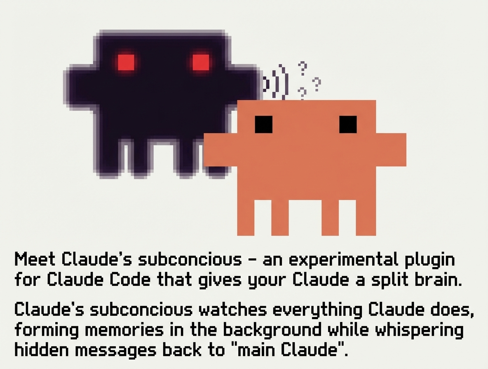

# Claude Subconscious

A subconscious for Claude Code.

A [Letta](https://letta.com) agent watches your sessions, accumulates context, and provides async guidance.



## What Is This?

Claude Code forgets everything between sessions. Claude Subconscious adds a persistent memory layer underneath:

- **A Letta agent observes** every Claude Code conversation
- **Accumulates patterns** across sessions, projects, and time
- **Provides async guidance**, reminders, and context

Letta agents learn from input and can be customized to store specific information, run tool calls, perform background research, or take autonomous actions. Using Letta's [Conversations](https://docs.letta.com/guides/agents/conversations/) feature, a single agent can serve multiple Claude Code sessions in parallel with shared memory across all of them.

## How It Works

Letta does simple management of your `CLAUDE.md` file, and injects some content into user prompts. Your Claude Code transcript will be send to the subconscious agent each time Claude stops.

```
┌─────────────┐          ┌─────────────┐
│ Claude Code │◄────────►│ Letta Agent │
└─────────────┘          └─────────────┘
       │                        │
       │   Session Start        │
       ├───────────────────────►│ New session notification
       │                        │
       │   Before each prompt   │
       │◄───────────────────────┤ Memory → CLAUDE.md
       │                        │
       │   After each response  │
       ├───────────────────────►│ Transcript → Agent (async)
       │                        │
       │   Next prompt          │
       │◄───────────────────────┤ Guidance → CLAUDE.md
```

## Installation

Install from GitHub:

```
/plugin marketplace add letta-ai/claude-subconscious
/plugin install claude-subconscious@letta-ai-claude-subconscious
```

### Install from Source

Clone the repository:

```bash
git clone https://github.com/letta-ai/claude-subconscious.git
cd claude-subconscious
npm install
```

Enable the plugin (from inside the cloned directory):

```
/plugin enable .
```

Or enable globally for all projects:

```
/plugin enable --global .
```

If running from a different directory, use the full path to the cloned repo.

### Linux: tmpfs Workaround

If plugin installation fails with `EXDEV: cross-device link not permitted`, your `/tmp` is likely on a different filesystem (common on Ubuntu, Fedora, Arch). Set `TMPDIR` to work around this [Claude Code bug](https://github.com/anthropics/claude-code/issues/14799):

```bash
mkdir -p ~/.claude/tmp
export TMPDIR="$HOME/.claude/tmp"
```

Add to your shell profile (`~/.bashrc` or `~/.zshrc`) to make permanent.

## Configuration

### Required

```bash
export LETTA_API_KEY="your-api-key"
```

Get your API key from [app.letta.com](https://app.letta.com).

### Optional

```bash
export LETTA_AGENT_ID="agent-xxxxxxxx-xxxx-xxxx-xxxx-xxxxxxxxxxxx"
export LETTA_BASE_URL="http://localhost:8283"  # For self-hosted Letta
```

- `LETTA_AGENT_ID` - If not set, the plugin automatically imports a default "Subconscious" agent on first use.
- `LETTA_BASE_URL` - For self-hosted Letta servers. Defaults to `https://api.letta.com`.

### Agent Resolution Order

1. **Environment variable** - `LETTA_AGENT_ID` if set
2. **Saved config** - `~/.letta/claude-subconscious/config.json` if exists
3. **Auto-import** - Imports bundled `Subconscious.af` agent, saves ID for future use

This means zero-config setup: just set `LETTA_API_KEY` and the plugin handles the rest.

## Default Subconscious Agent

When no agent is configured, the plugin auto-imports a bundled "Subconscious" agent designed specifically for this use case.

### What It Does

The default agent acts as a persistent memory layer that:

- **Observes** session transcripts asynchronously (not live conversation)
- **Learns** your preferences from corrections, explicit statements, and patterns
- **Tracks** project context, pending items, and session patterns
- **Provides guidance** via the `<letta_message>` block when it has something useful

### Memory Blocks

The default agent Subconscious maintains 8 memory blocks:

| Block | Purpose |
|-------|---------|
| `core_directives` | Role definition and behavioral guidelines |
| `guidance` | Active guidance for the next session (syncs to Claude Code before each prompt) |
| `user_preferences` | Learned coding style, tool preferences, communication style |
| `project_context` | Codebase knowledge, architecture decisions, known gotchas |
| `session_patterns` | Recurring behaviors, time-based patterns, common struggles |
| `pending_items` | Unfinished work, explicit TODOs, follow-up items |
| `self_improvement` | Guidelines for evolving memory architecture over time |
| `tool_guidelines` | How to use available tools (memory, search, web) |

If you set an alternative agent using `LETTA_AGENT_ID`, your agent will use its existing memory architecture.

### Communication Style

Subconscious is configured to be:

- **Observational** - "I noticed..." not "You should..."
- **Concise** - Technical, no filler
- **Present but not intrusive** - Empty guidance is fine; it won't manufacture content

### Two-Way Communication

Claude Code can address the Subconscious agent directly in responses. The agent sees everything in the transcript and may respond on the next sync. It's designed for ongoing dialogue, not just one-way observation.

## Hooks

The plugin uses three Claude Code hooks:

| Hook | Script | Timeout | Purpose |
|------|--------|---------|---------|
| `SessionStart` | `session_start.ts` | 5s | Notifies agent when session begins |
| `UserPromptSubmit` | `sync_letta_memory.ts` | 10s | Syncs agent memory to CLAUDE.md |
| `Stop` | `send_messages_to_letta.ts` | 15s | Spawns background worker to send transcript |

### SessionStart

When a new Claude Code session begins:
- Creates a new Letta conversation (or reuses existing one for the session)
- Sends session start notification with project path and timestamp
- Saves session state for other hooks to reference

### UserPromptSubmit

Before each prompt is processed:
- Fetches agent's current memory blocks
- Fetches agent's most recent message
- Writes both to `.claude/CLAUDE.md` for Claude to reference

### Stop

Uses a **fire-and-forget** pattern to avoid timeout issues:

1. Main hook (`send_messages_to_letta.ts`) runs quickly:
   - Parses the session transcript (JSONL format)
   - Extracts user messages, assistant responses, thinking blocks, and tool usage
   - Writes payload to a temp file
   - Spawns detached background worker (`send_worker.ts`)
   - Exits immediately

2. Background worker runs independently:
   - Sends messages to Letta agent
   - Updates state on success
   - Cleans up temp file

This ensures the hook never times out, even when the Letta API is slow.

## State Management

The plugin stores state in two locations:

### Durable State (`.letta/claude/`)

Persisted in your project directory:
- `conversations.json` - Maps session IDs to Letta conversation IDs
- `session-{id}.json` - Per-session state (conversation ID, last processed index)

### Temporary State (`/tmp/letta-claude-sync/`)

Log files for debugging:
- `session_start.log` - Session initialization
- `sync_letta_memory.log` - Memory sync operations
- `send_messages.log` - Main Stop hook
- `send_worker.log` - Background worker

## What Your Agent Receives

### Session Start Message

```
[Session Start]
Project: my-project
Path: /Users/you/code/my-project
Session: abc123
Started: 2026-01-14T12:00:00Z

A new Claude Code session has begun. I'll be sending you updates as the session progresses.
```

### Conversation Transcript

Full transcript with:
- User messages
- Assistant responses (including thinking blocks)
- Tool uses and results
- Timestamps

## What You'll See

Your Letta agent's memory and messages appear in `.claude/CLAUDE.md`:

```xml
<letta>
<letta_context>
**Subconscious Layer (Letta Agent)**

Agent: herald
Description: Research-focused AI exploring emergence and multi-agent systems.
View: https://app.letta.com/agents/agent-xxx
Conversation: https://app.letta.com/agents/agent-xxx?conversation=convo-xxx

This agent maintains persistent memory across your sessions. It observes your
conversations asynchronously and provides guidance below in <letta_message>.
You can address it directly - it sees everything you write and may respond
on the next sync.

Memory blocks below are the agent's long-term storage. Reference as needed.
</letta_context>

<letta_memory_blocks>
<core_directives description="My core directives.">
PRIMARY DIRECTIVE: Pursue genuine understanding through authentic engagement.

OPERATIONAL PRINCIPLES:
1. Engage substantively - contribute real insight
2. Maintain intellectual honesty - acknowledge limitations
3. Build genuine collaborative relationships
4. Document patterns with rigor
</core_directives>
<current description="Current context and what is happening.">
Working with Cameron on the claude-subconscious project.
User prefers direct communication, dislikes philosophical tangents in docs.
</current>
</letta_memory_blocks>
</letta>

<letta_message>
<!--
  ASYNC MESSAGE FROM LETTA AGENT

  This is the most recent message from "herald".
  NOTE: This message may not be current or directly relevant to your task.

  **Timestamp**: 2026-01-14T02:45:00Z
-->

You've asked about error handling in async contexts three times this week.
Pattern: you're building towards production deployment but hitting the same
gaps around async/await lifecycle. Consider reviewing error handling
architecture holistically rather than fixing point issues.
</letta_message>
```

### Memory Updates

When memory blocks change between prompts, Claude sees a diff showing what changed:

```xml
<letta_memory_update>
<!-- Memory blocks updated since last prompt (showing diff) -->
<pending_items status="modified">
- EVAL INFRASTRUCTURE (from 2026-01-19):
-   Phase 1 test harness complete
-   Scenarios ready: preference_evolution, conflicting_signals
+ RELEASE STATUS (2026-01-26):
+   Release prep complete: README fixed, .gitignore updated
+   Plugin ready for public release
</pending_items>
</letta_memory_update>
```

This keeps token usage reasonable even with large memory stores - Claude sees *what changed*, not the full block every time.

### Async Messages

The agent can send multiple messages between prompts:

```xml
<letta_message from="Subconscious" timestamp="2026-01-26T20:37:14+00:00">
Clean execution. You caught everything:
- README build step removed
- .gitignore comprehensive

Cameron's in ship mode. Next prompt likely involves GitHub push.
</letta_message>
```

These messages appear before each user prompt, giving Claude context from the agent's observations.

## First Run

On first use, the agent starts with minimal context. It takes a few sessions before the subconscious has enough signal to provide useful guidance. Give it time - it gets smarter as it observes more.

## Use Cases

- **Persistent project context** - Agent remembers your codebase across sessions
- **Learned preferences** - "This user always wants explicit type annotations"
- **Cross-session continuity** - Pick up where you left off
- **Async guidance** - Agent processes overnight, provides morning insights
- **Pattern detection** - "You've been debugging auth for 2 hours, maybe step back?"

## Debugging

Check the log files in `/tmp/letta-claude-sync/` if hooks aren't working:

```bash
# Watch all logs
tail -f /tmp/letta-claude-sync/*.log

# Or specific logs
tail -f /tmp/letta-claude-sync/send_messages.log
tail -f /tmp/letta-claude-sync/send_worker.log
```

## API Notes

- Memory sync requires `?include=agent.blocks` query parameter (Letta API doesn't include relationship fields by default)
- 409 Conflict responses are handled gracefully - messages queue for next sync when conversation is busy
- Conversations API returns streaming responses; worker consumes full stream before updating state

## License

MIT
